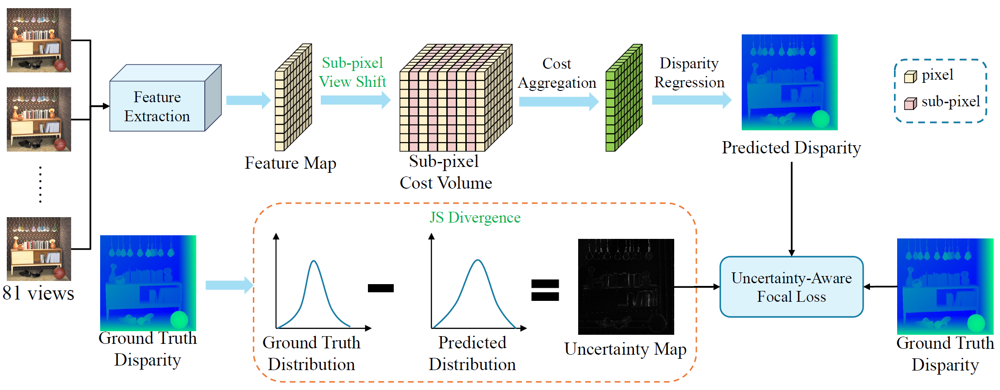
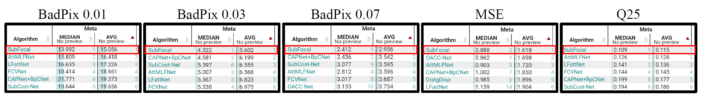

# Learning Sub-Pixel Disparity Distribution for Light Field Depth Estimation


<!-- **Learning Sub-Pixel Disparity Distribution for Light Field Depth Estimation**  -->


## Network Architecture


# SOTA on 4D Light Field Benchmark
- Our method **ranks the first place** on the HCI 4D LF Benchmark in terms of all the five accuracy
metrics (i.e., BadPix0.01, BadPix0.03, BadPix0.07, MSE and Q25).

  

- For more detail comparison, please use the link below.
- [Benchmark link](https://lightfield-analysis.uni-konstanz.de/benchmark/table?column-type=images&metric=badpix_0070)

# Environment
```
Ubuntu            16.04
Python            3.8.10
Tensorflow-gpu    2.5.0
CUDA              11.2
```

# Two-Stage Train SubFocal
1. Download HCI Light field dataset from <http://hci-lightfield.iwr.uni-heidelberg.de/>.  
2. Unzip the LF dataset and move **'additional/, training/, test/, stratified/ '** into the **'hci_dataset/'**.
4. **Stage 1:** Run `python train_sub.py`
  - Checkpoint files will be saved in **'LF_checkpoints/XXX_ckp/iterXXXX_valmseXXXX_bpXXX.hdf5'**.
  - Training process will be saved in 
    - **'LF_output/XXX_ckp/train_iterXXXXX.jpg'**
    - **'LF_output/XXX_ckp/val_iterXXXXX.jpg'**.
5. **Stage 2:** Run `python train_sub_js.py`
  - Satge 1 model as pretrained, finetune `load_weight_is=True`
  - `path_weight='LF_checkpoint/SubFocal_sub_0.5_ckp/iter0049_valmse0.845_bp2.04.hdf5'`

# Evaluate SubFocal
- Run `python evaluation.py`
  - `path_weight='LF_checkpoint/SubFocal_sub_0.5_js_0.1_ckp/iter0010_valmse0.768_bp1.93.hdf5'`

# Submit SubFocal
- Run `python submission.py`
  - `path_weight='LF_checkpoint/SubFocal_sub_0.5_js_0.1_ckp/iter0010_valmse0.768_bp1.93.hdf5'`
<!-- # Citation
```
@inproceedings{Tsai:2020:ABV,
        author = {Tsai, Yu-Ju and Liu, Yu-Lun and Ouhyoung, Ming and Chuang, Yung-Yu},
        title = {Attention-based View Selection Networks for Light-field Disparity Estimation},
        booktitle = {Proceedings of the 34th Conference on Artificial Intelligence (AAAI)},
        year = {2020}
}
``` -->

Last modified data: 2022/08/18.

The code is modified and heavily borrowed from LFattNet: <https://github.com/LIAGM/LFattNet>

The code they provided is greatly appreciated.


